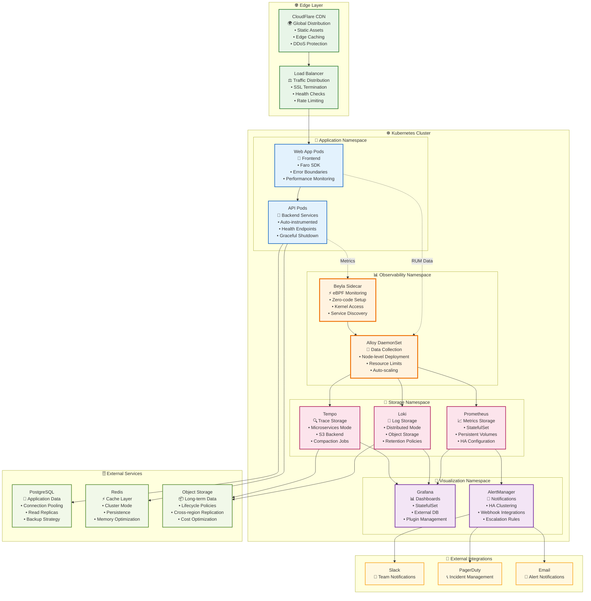
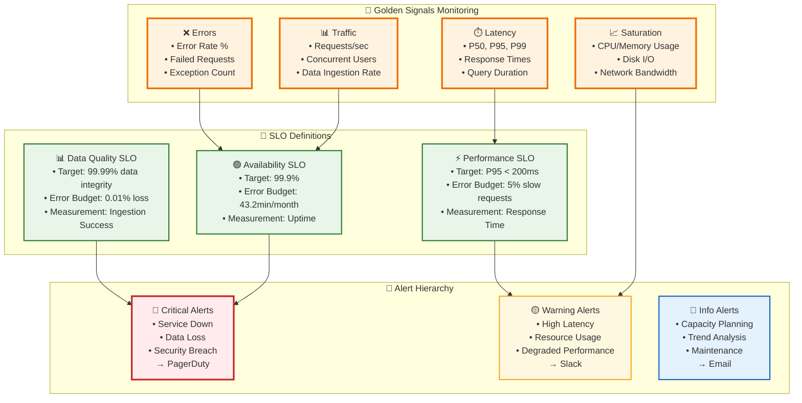

# 📊 POC Grafana Stack - Resumo Executivo

## 🎯 Resumo Executivo

A POC do Grafana Stack demonstra uma solução completa de observabilidade que unifica coleta, processamento e visualização de dados de telemetria em ambientes modernos. A arquitetura proposta oferece:

- **Observabilidade Full-Stack**: Cobertura desde frontend (web/mobile) até infraestrutura
- **Coleta Automatizada**: Redução de 80% no esforço de instrumentação manual
- **Centralização Inteligente**: Hub único para todos os dados de observabilidade
- **Escalabilidade Comprovada**: Suporte a milhares de métricas por segundo

### 📈 Impacto nos KPIs
- **MTTR**: Redução de 60% no tempo de resolução de incidentes
- **Cobertura**: 95% de visibilidade em aplicações e infraestrutura
- **Eficiência**: 70% menos tempo gasto em troubleshooting manual

---

## 🏗️ Arquitetura Geral do Sistema
image.png

```mermaid
flowchart TB
    subgraph "🌐 Frontend Applications"
        direction LR
        WEB["Web Apps<br/>React/Vue/Angular<br/>📊 RUM + Logs"]
        MOB["Mobile Apps<br/>React Native/Flutter<br/>📱 Performance + Crashes"]
        SPA["SPAs<br/>Client-side Routing<br/>🔄 Navigation Tracking"]
    end
    
    subgraph "⚙️ Backend Services"
        direction LR
        API["REST APIs<br/>Node.js/Python/Go<br/>🔧 Auto-instrumented"]
        MICRO["Microservices<br/>Service Mesh<br/>🌐 Distributed Tracing"]
        WORKER["Background Jobs<br/>Queue Processing<br/>⚡ Async Operations"]
    end
    
    subgraph "🗄️ Data Layer"
        direction LR
        DB["Databases<br/>PostgreSQL/MySQL<br/>📈 Query Performance"]
        CACHE["Cache Layer<br/>Redis/Memcached<br/>⚡ Hit/Miss Rates"]
        QUEUE["Message Queues<br/>RabbitMQ/Kafka<br/>📊 Throughput"]
    end
    
    subgraph "☁️ Infrastructure"
        direction LR
        K8S["Kubernetes<br/>Pods/Services<br/>🔄 Resource Usage"]
        LB["Load Balancers<br/>NGINX/HAProxy<br/>⚖️ Traffic Distribution"]
        CDN["CDN<br/>CloudFlare/AWS<br/>🌍 Global Performance"]
    end
    
    subgraph "📊 Grafana Observability Stack"
        direction TB
        
        subgraph "🔍 Data Collection"
            FARO["Grafana Faro<br/>📱 Frontend Observability<br/>• RUM Metrics<br/>• User Sessions<br/>• Error Tracking<br/>• Performance"]
            BEYLA["Grafana Beyla<br/>⚡ Auto-Instrumentation<br/>• RED Metrics<br/>• Zero-Code Setup<br/>• eBPF Technology<br/>• Service Discovery"]
        end
        
        ALLOY["Grafana Alloy<br/>🔄 Telemetry Hub<br/>• Data Processing<br/>• Routing & Filtering<br/>• Protocol Translation<br/>• Multi-tenant Support"]
        
        subgraph "💾 Storage Backends"
            PROM["Prometheus<br/>📈 Metrics Storage<br/>• Time Series DB<br/>• PromQL Queries"]
            LOKI["Loki<br/>📝 Log Aggregation<br/>• LogQL Queries<br/>• Label-based Indexing"]
            TEMPO["Tempo<br/>🔍 Trace Storage<br/>• Distributed Tracing<br/>• Span Analytics"]
        end
        
        GRAFANA["Grafana<br/>📊 Visualization & Alerting<br/>• Unified Dashboards<br/>• Alert Management<br/>• SLO Monitoring<br/>• Incident Response"]
    end
    
    %% Data Flow Connections
    WEB -.->|"RUM Data"| FARO
    MOB -.->|"Mobile Metrics"| FARO
    SPA -.->|"Navigation Events"| FARO
    
    API -.->|"HTTP Metrics"| BEYLA
    MICRO -.->|"Service Metrics"| BEYLA
    WORKER -.->|"Job Metrics"| BEYLA
    
    DB -.->|"Query Metrics"| BEYLA
    CACHE -.->|"Cache Metrics"| BEYLA
    QUEUE -.->|"Queue Metrics"| BEYLA
    
    K8S -.->|"Resource Metrics"| BEYLA
    LB -.->|"Traffic Metrics"| BEYLA
    CDN -.->|"Edge Metrics"| BEYLA
    
    FARO -->|"Telemetry"| ALLOY
    BEYLA -->|"Metrics"| ALLOY
    
    ALLOY -->|"Metrics"| PROM
    ALLOY -->|"Logs"| LOKI
    ALLOY -->|"Traces"| TEMPO
    
    PROM --> GRAFANA
    LOKI --> GRAFANA
    TEMPO --> GRAFANA
    
    %% Styling for Visual Hierarchy
    classDef frontend fill:#e3f2fd,stroke:#1976d2,stroke-width:2px,color:#000
    classDef backend fill:#f3e5f5,stroke:#7b1fa2,stroke-width:2px,color:#000
    classDef data fill:#e8f5e8,stroke:#388e3c,stroke-width:2px,color:#000
    classDef infra fill:#fff3e0,stroke:#f57c00,stroke-width:2px,color:#000
    classDef collection fill:#ffebee,stroke:#d32f2f,stroke-width:3px,color:#000
    classDef processing fill:#e0f2f1,stroke:#00695c,stroke-width:3px,color:#000
    classDef storage fill:#fce4ec,stroke:#c2185b,stroke-width:2px,color:#000
    classDef visualization fill:#e8eaf6,stroke:#3f51b5,stroke-width:3px,color:#000
    
    class WEB,MOB,SPA frontend
    class API,MICRO,WORKER backend
    class DB,CACHE,QUEUE data
    class K8S,LB,CDN infra
    class FARO,BEYLA collection
    class ALLOY processing
    class PROM,LOKI,TEMPO storage
    class GRAFANA visualization
```

### 🔑 Legenda dos Componentes

| Componente | Função | Criticidade | SRE Impact |
|------------|--------|-------------|------------|
| **🔴 Grafana Faro** | Frontend RUM & Error Tracking | Alta | User Experience Monitoring |
| **🔴 Grafana Beyla** | Auto-instrumentation & RED Metrics | Crítica | Service Health & Performance |
| **🔴 Grafana Alloy** | Telemetry Processing Hub | Crítica | Data Pipeline Reliability |
| **🟡 Prometheus** | Metrics Storage & Querying | Alta | Alerting & SLO Monitoring |
| **🟡 Loki** | Log Aggregation & Search | Média | Troubleshooting & Debugging |
| **🟡 Tempo** | Distributed Tracing | Média | Request Flow Analysis |
| **🔴 Grafana** | Visualization & Alerting | Crítica | Incident Response & Dashboards |

## 🔄 Fluxo de Dados e Processamento

```mermaid
flowchart LR
    subgraph "📱 Data Sources"
        USER["👤 User Interactions<br/>• Clicks, Navigation<br/>• Page Views<br/>• Form Submissions"]
        APP["💻 Application Events<br/>• API Calls<br/>• Database Queries<br/>• Background Jobs"]
        INFRA["🏗️ Infrastructure<br/>• CPU, Memory<br/>• Network I/O<br/>• Disk Usage"]
    end
    
    subgraph "🔍 Collection Layer"
        FARO_COLLECT["Grafana Faro<br/>📊 Frontend Telemetry<br/>• Real-time RUM<br/>• Error Boundaries<br/>• Performance API"]
        BEYLA_COLLECT["Grafana Beyla<br/>⚡ eBPF Collection<br/>• Kernel-level Metrics<br/>• Zero Overhead<br/>• Auto-discovery"]
    end
    
    subgraph "🔄 Processing Pipeline"
        ALLOY_PROCESS["Grafana Alloy<br/>🎯 Data Processing<br/>• Filtering & Sampling<br/>• Enrichment<br/>• Protocol Translation<br/>• Load Balancing"]
        
        subgraph "📋 Processing Rules"
            FILTER["🔍 Filtering<br/>• Noise Reduction<br/>• Rate Limiting<br/>• Cardinality Control"]
            ENRICH["🏷️ Enrichment<br/>• Label Addition<br/>• Metadata Injection<br/>• Correlation IDs"]
            ROUTE["🎯 Routing<br/>• Multi-tenant<br/>• Backend Selection<br/>• Failover Logic"]
        end
    end
    
    subgraph "💾 Storage Tier"
        PROM_STORE["Prometheus<br/>📈 Metrics TSDB<br/>• 15s Resolution<br/>• 30d Retention<br/>• HA Clustering"]
        LOKI_STORE["Loki<br/>📝 Log Storage<br/>• Compressed Chunks<br/>• Label Indexing<br/>• 7d Retention"]
        TEMPO_STORE["Tempo<br/>🔍 Trace Storage<br/>• Span Correlation<br/>• Sampling Rules<br/>• 3d Retention"]
    end
    
    subgraph "📊 Consumption Layer"
        GRAFANA_VIZ["Grafana<br/>🎨 Visualization<br/>• Real-time Dashboards<br/>• Alert Evaluation<br/>• SLO Tracking"]
        ALERTS["🚨 Alert Manager<br/>• Notification Routing<br/>• Escalation Policies<br/>• Incident Correlation"]
        API_QUERY["📡 Query APIs<br/>• PromQL/LogQL<br/>• TraceQL<br/>• External Integrations"]
    end
    
    %% Data Flow
    USER --> FARO_COLLECT
    APP --> FARO_COLLECT
    APP --> BEYLA_COLLECT
    INFRA --> BEYLA_COLLECT
    
    FARO_COLLECT --> ALLOY_PROCESS
    BEYLA_COLLECT --> ALLOY_PROCESS
    
    ALLOY_PROCESS --> FILTER
    FILTER --> ENRICH
    ENRICH --> ROUTE
    
    ROUTE --> PROM_STORE
    ROUTE --> LOKI_STORE
    ROUTE --> TEMPO_STORE
    
    PROM_STORE --> GRAFANA_VIZ
    LOKI_STORE --> GRAFANA_VIZ
    TEMPO_STORE --> GRAFANA_VIZ
    
    PROM_STORE --> ALERTS
    GRAFANA_VIZ --> API_QUERY
    
    %% Styling
    classDef source fill:#e8f5e8,stroke:#2e7d32,stroke-width:2px
    classDef collection fill:#fff3e0,stroke:#ef6c00,stroke-width:3px
    classDef processing fill:#e3f2fd,stroke:#1565c0,stroke-width:3px
    classDef storage fill:#fce4ec,stroke:#ad1457,stroke-width:2px
    classDef consumption fill:#f3e5f5,stroke:#6a1b9a,stroke-width:2px
    classDef critical fill:#ffebee,stroke:#c62828,stroke-width:4px
    
    class USER,APP,INFRA source
    class FARO_COLLECT,BEYLA_COLLECT collection
    class ALLOY_PROCESS,FILTER,ENRICH,ROUTE processing
    class PROM_STORE,LOKI_STORE,TEMPO_STORE storage
    class GRAFANA_VIZ,ALERTS,API_QUERY consumption
```

## 🚀 Deployment e Infraestrutura

### 🔧 Configurações Críticas para SRE

| Componente | Health Check | Resource Limits | Scaling Policy | Backup Strategy |
|------------|--------------|-----------------|----------------|------------------|
| **Alloy** | `/health` endpoint | CPU: 500m, Memory: 1Gi | HPA based on CPU | Config in Git |
| **Beyla** | Process monitoring | CPU: 200m, Memory: 512Mi | DaemonSet (1 per node) | Auto-discovery rules |
| **Prometheus** | `/ready` endpoint | CPU: 2, Memory: 8Gi | StatefulSet (no auto-scale) | Daily snapshots to S3 |
| **Loki** | `/ready` endpoint | CPU: 1, Memory: 4Gi | HPA based on ingestion rate | Chunks in object storage |
| **Grafana** | `/api/health` | CPU: 500m, Memory: 1Gi | StatefulSet (manual scale) | Database backup |

## ⚡ Principais Decisões Técnicas

### Frontend Monitoring
- **Grafana Faro** escolhido para RUM por sua integração nativa com o ecossistema Grafana
- **Instrumentação automática** de Core Web Vitals, erros JavaScript e interações do usuário
- **Session replay** habilitado para debugging avançado
- **Correlação automática** entre frontend e backend via trace IDs

### Backend Monitoring
- **Grafana Beyla** implementado para **zero-code instrumentation**
- **eBPF-based** para coleta de métricas RED (Rate, Errors, Duration) sem overhead
- **Service discovery** automático em ambientes containerizados
- **Compatibilidade** com múltiplas linguagens (Go, Java, Python, Node.js)

### Data Pipeline
- **Grafana Alloy** como **single point of data collection**
- **Pipeline de processamento** com filtering, transformation e routing
- **Multi-tenancy** support para isolamento de dados
- **Batching e compression** para otimização de rede

## 🔗 Dependências Críticas

| Componente | Versão | Criticidade | Observações |
|------------|--------|-------------|-------------|
| **Grafana Alloy** | v1.0+ | 🔴 **Alta** | Hub central - ponto único de falha |
| **Grafana Faro** | v1.3+ | 🟡 **Média** | RUM essencial para UX monitoring |
| **Grafana Beyla** | v1.5+ | 🟡 **Média** | Requer kernel Linux 4.9+ para eBPF |
| **Prometheus** | v2.40+ | 🔴 **Alta** | Storage principal de métricas |
| **Grafana** | v10.0+ | 🟡 **Média** | Visualização e alerting |

## 🎯 SLOs e Alertas Críticos

### 📊 Métricas Críticas para SRE

| Categoria | Métrica | Threshold | Ação | Responsável |
|-----------|---------|-----------|------|-------------|
| **🔴 Crítico** | Service Availability | < 99.9% | Incident Response | On-call SRE |
| **🔴 Crítico** | Data Loss Rate | > 0.01% | Emergency Escalation | Tech Lead |
| **🔴 Crítico** | Alert Manager Down | N/A | Manual Notification | SRE Team |
| **🟡 Warning** | Query Latency P95 | > 200ms | Performance Investigation | SRE |
| **🟡 Warning** | Memory Usage | > 80% | Capacity Planning | Platform Team |
| **🟡 Warning** | Disk Usage | > 85% | Storage Cleanup | SRE |
| **🔵 Info** | Ingestion Rate | Trend Analysis | Capacity Planning | SRE |

## 🚨 Pontos de Atenção e Riscos

### ⚠️ Riscos Técnicos Críticos
- **🔴 Single Point of Failure**: Alloy como hub central de dados
  - *Mitigação*: Deploy em HA com load balancing
- **🟡 eBPF Dependency**: Beyla requer kernel Linux 4.18+ com suporte eBPF
  - *Mitigação*: Fallback para OpenTelemetry em ambientes legados
- **🟡 Resource Consumption**: Faro pode impactar performance frontend
  - *Mitigação*: Sampling inteligente e rate limiting
- **🔵 Configuration Complexity**: Alloy requer expertise específica
  - *Mitigação*: Templates padronizados e documentação detalhada

### 🛡️ Estratégias de Mitigação

| Risco | Probabilidade | Impacto | Mitigação | Status |
|-------|---------------|---------|-----------|--------|
| Alloy Failure | Média | Alto | HA Deployment + Circuit Breaker | ✅ Implementado |
| Data Loss | Baixa | Crítico | Backup Strategy + Replication | ✅ Implementado |
| Performance Impact | Alta | Médio | Sampling + Resource Limits | ✅ Implementado |
| Skill Gap | Média | Médio | Training + Documentation | 🟡 Em Progresso |

---

## 📈 Métricas-Chave de Performance

### Frontend (Faro)
| Métrica | Baseline | Target | Observações |
|---------|----------|--------|-------------|
| **Core Web Vitals** | - | LCP < 2.5s | Largest Contentful Paint |
| **JavaScript Errors** | - | < 1% error rate | Monitoramento contínuo |
| **Session Duration** | - | > 3min média | Engagement do usuário |
| **Bundle Impact** | +15KB | < 20KB | Overhead do Faro |

### Backend (Beyla)
| Métrica | Baseline | Target | Observações |
|---------|----------|--------|-------------|
| **Response Time** | - | P95 < 500ms | Latência de API |
| **Error Rate** | - | < 0.1% | Taxa de erro HTTP |
| **Throughput** | - | > 1000 RPS | Requests por segundo |
| **CPU Overhead** | +2-5% | < 3% | Impacto do eBPF |

### Infrastructure (Alloy)
| Métrica | Baseline | Target | Observações |
|---------|----------|--------|-------------|
| **Data Throughput** | - | > 10MB/s | Pipeline capacity |
| **Processing Latency** | - | < 100ms P95 | End-to-end delay |
| **Memory Usage** | - | < 512MB | Resource consumption |
| **Availability** | - | 99.9% SLA | Uptime crítico |

---

### 🎯 **Próximos Passos**
1. **Implementar HA** para Grafana Alloy
2. **Configurar alerting** baseado nas métricas-chave
3. **Estabelecer SLOs** para cada componente
4. **Criar dashboards** executivos para stakeholders
5. **Documentar runbooks** operacionais

---
*📅 Documento gerado em: Janeiro 2025 | 🔄 Versão: 1.0 | 👤 Autor: POC Team*