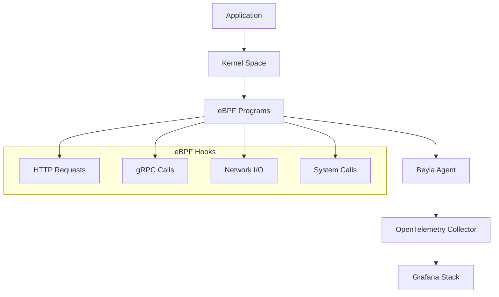

# ⚡ Grafana Beyla - Auto-instrumentação eBPF

## 🎯 Visão Geral

O **Grafana Beyla** é uma ferramenta de auto-instrumentação baseada em eBPF que coleta métricas RED (Rate, Error, Duration) e traces distribuídos automaticamente, sem necessidade de modificação de código.

> **Nota Importante**: O Beyla foi doado ao projeto OpenTelemetry e agora é conhecido como **OpenTelemetry eBPF Instrumentation (OBI)**.

### 🔑 Características Principais
- **Zero-code instrumentation** via eBPF
- **Métricas RED automáticas** (Rate, Error, Duration)
- **Distributed tracing** sem modificação de código
- **Multi-language support** (Go, Java, Python, Node.js, .NET, etc.)
- **HTTP/HTTPS e gRPC** monitoring
- **Integração nativa** com OpenTelemetry e Grafana Stack

## 🏗️ Arquitetura eBPF

### 🔧 **Como Funciona**



### 🎯 **Pontos de Instrumentação**
- **HTTP/HTTPS**: Requests e responses automáticos
- **gRPC**: Calls e streams
- **Network sockets**: TCP/UDP connections
- **System calls**: File I/O, network operations
- **SSL/TLS**: Encrypted traffic analysis

## 📋 Capacidades Detalhadas

### 📊 **Métricas RED Automáticas**

#### Rate (Taxa)
- **Requests per second** por serviço
- **Throughput** de operações
- **Connection rate** para network services
- **Error rate** percentage

#### Error (Erros)
- **HTTP error codes** (4xx, 5xx)
- **gRPC error codes**
- **Connection failures**
- **Timeout errors**

#### Duration (Duração)
- **Response time** histograms
- **Latency percentiles** (P50, P95, P99)
- **Request duration** distributions
- **Connection establishment time**

### 🕸️ **Distributed Tracing**

#### Automatic Trace Generation
- **HTTP request traces** end-to-end
- **gRPC call traces** com metadata
- **Database query traces** (quando detectável)
- **Inter-service communication** mapping

#### Trace Correlation
- **Parent-child relationships** automáticos
- **Trace ID propagation** via headers
- **Span correlation** entre serviços
- **Baggage propagation** para contexto

### 🔍 **Service Discovery**

#### Automatic Detection
- **Process discovery** via /proc filesystem
- **Port scanning** para serviços ativos
- **Container awareness** (Docker, Kubernetes)
- **Service naming** baseado em heurísticas

#### Metadata Enrichment
- **Service version** detection
- **Environment labels** automáticos
- **Container metadata** (image, labels)
- **Kubernetes annotations** e labels

## ⚙️ Configuração e Deployment

### 🐧 **Requisitos do Sistema**

```yaml
# Requisitos mínimos
OS: Linux
Kernel: 5.8+ (com eBPF habilitado)
Architecture: x86_64, ARM64
Privileges: CAP_SYS_ADMIN ou root
Memory: 100MB+ disponível
CPU: Minimal overhead (<2%)
```

### 📦 **Instalação**

#### Via Docker (Recomendado)
```bash
# 1. Download da imagem
docker pull grafana/beyla:latest

# 2. Execução básica
docker run -d \
  --name beyla \
  --pid host \
  --privileged \
  -v /sys/kernel/debug:/sys/kernel/debug:ro \
  -v /sys/fs/bpf:/sys/fs/bpf \
  -e BEYLA_OPEN_PORT=8080 \
  -e OTEL_EXPORTER_OTLP_ENDPOINT=http://alloy:4317 \
  grafana/beyla:latest
```

#### Via Binary
```bash
# 1. Download do binary
wget https://github.com/grafana/beyla/releases/latest/download/beyla-linux-amd64.tar.gz
tar -xzf beyla-linux-amd64.tar.gz

# 2. Instalação
sudo mv beyla /usr/local/bin/
sudo chmod +x /usr/local/bin/beyla

# 3. Execução
sudo beyla --config=/etc/beyla/config.yml
```

### ⚙️ **Configuração Básica**

```yaml:d%3A%2FREPO%2Fpoc-porto%2Fexamples%2Fbeyla-config%2Fbeyla.yml
# Configuração básica do Beyla
print_traces: false

# Descoberta de serviços
discovery:
  services:
    - open_ports: "8080,8443"  # Portas a monitorar
    - exe_path: "/usr/bin/myapp"  # Executável específico
    - k8s_namespace: "production"  # Namespace Kubernetes

# Configuração de atributos
attributes:
  kubernetes:
    enable: true
    cluster_name: "my-cluster"
  instance_id:
    dns: true

# Exportadores OpenTelemetry
otel_traces_export:
  endpoint: http://alloy:4317
  insecure: true
  protocol: grpc

otel_metrics_export:
  endpoint: http://alloy:4317
  insecure: true
  protocol: grpc
  interval: 30s

# Configurações de performance
ebpf:
  batch_length: 100
  batch_timeout: 1s
  ring_buffer_len: 8192

# Logging
log_level: info
```

### 🎛️ **Configuração Avançada**

```yaml:d%3A%2FREPO%2Fpoc-porto%2Fexamples%2Fbeyla-config%2Fbeyla-advanced.yml
# Configuração avançada do Beyla
print_traces: false

# Descoberta avançada de serviços
discovery:
  services:
    # Monitorar por porta
    - open_ports: "8080-8090,9000"
      name: "web-services"
      namespace: "frontend"
    
    # Monitorar por executável
    - exe_path: "/opt/myapp/bin/server"
      name: "my-backend"
      namespace: "backend"
    
    # Monitorar por container
    - k8s_pod_name: "api-.*"
      k8s_namespace: "production"
      name: "api-services"
    
    # Monitorar por PID
    - pid: 1234
      name: "legacy-service"

# Enriquecimento de atributos
attributes:
  # Kubernetes metadata
  kubernetes:
    enable: true
    cluster_name: "production-cluster"
    informers_sync_timeout: 30s
  
  # Instance identification
  instance_id:
    dns: true
    override: "custom-instance-id"
  
  # Custom attributes
  select:
    beyla_ip: "true"
    beyla_port: "true"
    http_request_method: "true"
    http_response_status_code: "true"
    http_route: "true"
    rpc_method: "true"
    rpc_system: "true"

# Configuração de rede
network:
  enable: true
  allowed_attributes:
    - src.address
    - dst.address
    - src.port
    - dst.port
    - iface
  cache_max_flows: 10000
  cache_active_timeout: 5m
  cache_inactive_timeout: 30s

# Exportadores múltiplos
otel_traces_export:
  # Grafana Alloy
  - endpoint: http://alloy:4317
    insecure: true
    protocol: grpc
    headers:
      authorization: "Bearer ${GRAFANA_TOKEN}"
  
  # Jaeger direto
  - endpoint: http://jaeger:14250
    insecure: true
    protocol: grpc

otel_metrics_export:
  endpoint: http://alloy:4318/v1/metrics
  insecure: true
  protocol: http/protobuf
  interval: 15s
  timeout: 10s

# Configurações eBPF avançadas
ebpf:
  # Buffer settings
  batch_length: 500
  batch_timeout: 500ms
  ring_buffer_len: 16384
  
  # Sampling
  sampling:
    traces: 1.0  # 100% dos traces
    metrics: 1.0  # 100% das métricas
  
  # Filtros
  filters:
    # Ignorar health checks
    - attribute: "http.route"
      match: "/health"
      action: "drop"
    
    # Ignorar requests internos
    - attribute: "http.target"
      match: "/internal/.*"
      action: "drop"

# Configurações de logging
log_level: info
log_format: json

# Configurações de profiling
profiling:
  enable: false
  port: 6060
```

## 🚀 Deployment Scenarios

### 🐳 **Docker Compose**

```yaml:d%3A%2FREPO%2Fpoc-porto%2Fdocker%2Fbeyla%2Fdocker-compose.yml
version: '3.8'

services:
  # Aplicação de exemplo
  web-app:
    image: nginx:alpine
    ports:
      - "8080:80"
    labels:
      - "beyla.monitor=true"
  
  # Beyla agent
  beyla:
    image: grafana/beyla:latest
    pid: host
    privileged: true
    volumes:
      - /sys/kernel/debug:/sys/kernel/debug:ro
      - /sys/fs/bpf:/sys/fs/bpf
      - ./beyla.yml:/etc/beyla/config.yml:ro
    environment:
      - BEYLA_CONFIG_PATH=/etc/beyla/config.yml
      - BEYLA_OPEN_PORT=8080
      - OTEL_EXPORTER_OTLP_ENDPOINT=http://alloy:4317
    depends_on:
      - web-app
      - alloy
  
  # Grafana Alloy
  alloy:
    image: grafana/alloy:latest
    ports:
      - "4317:4317"  # OTLP gRPC
      - "4318:4318"  # OTLP HTTP
    volumes:
      - ./alloy.yml:/etc/alloy/config.alloy:ro
    command:
      - run
      - /etc/alloy/config.alloy
      - --server.http.listen-addr=0.0.0.0:12345
```

### ☸️ **Kubernetes DaemonSet**

```yaml:d%3A%2FREPO%2Fpoc-porto%2Fexamples%2Fbeyla-config%2Fk8s-daemonset.yml
apiVersion: apps/v1
kind: DaemonSet
metadata:
  name: beyla
  namespace: observability
spec:
  selector:
    matchLabels:
      app: beyla
  template:
    metadata:
      labels:
        app: beyla
    spec:
      serviceAccountName: beyla
      hostPID: true
      hostNetwork: true
      containers:
      - name: beyla
        image: grafana/beyla:latest
        securityContext:
          privileged: true
        env:
        - name: BEYLA_CONFIG_PATH
          value: "/etc/beyla/config.yml"
        - name: OTEL_EXPORTER_OTLP_ENDPOINT
          value: "http://alloy.observability.svc.cluster.local:4317"
        - name: BEYLA_KUBE_METADATA_ENABLE
          value: "true"
        volumeMounts:
        - name: config
          mountPath: /etc/beyla
        - name: debugfs
          mountPath: /sys/kernel/debug
          readOnly: true
        - name: bpffs
          mountPath: /sys/fs/bpf
        - name: proc
          mountPath: /host/proc
          readOnly: true
        resources:
          requests:
            memory: "100Mi"
            cpu: "100m"
          limits:
            memory: "500Mi"
            cpu: "500m"
      volumes:
      - name: config
        configMap:
          name: beyla-config
      - name: debugfs
        hostPath:
          path: /sys/kernel/debug
      - name: bpffs
        hostPath:
          path: /sys/fs/bpf
      - name: proc
        hostPath:
          path: /proc
      tolerations:
      - operator: Exists
        effect: NoSchedule
---
apiVersion: v1
kind: ServiceAccount
metadata:
  name: beyla
  namespace: observability
---
apiVersion: rbac.authorization.k8s.io/v1
kind: ClusterRole
metadata:
  name: beyla
rules:
- apiGroups: [""]
  resources: ["pods", "services", "endpoints"]
  verbs: ["get", "list", "watch"]
- apiGroups: ["apps"]
  resources: ["deployments", "replicasets"]
  verbs: ["get", "list", "watch"]
---
apiVersion: rbac.authorization.k8s.io/v1
kind: ClusterRoleBinding
metadata:
  name: beyla
roleRef:
  apiGroup: rbac.authorization.k8s.io
  kind: ClusterRole
  name: beyla
subjects:
- kind: ServiceAccount
  name: beyla
  namespace: observability
```

## 📊 Métricas e Observabilidade

### 📈 **Métricas Exportadas**

#### HTTP Metrics
```promql
# Request rate
http_server_request_duration_seconds_count

# Error rate
rate(http_server_request_duration_seconds_count{status_code=~"5.."}[5m])

# Latency percentiles
histogram_quantile(0.95, http_server_request_duration_seconds_bucket)

# Throughput
sum(rate(http_server_request_duration_seconds_count[5m])) by (service_name)
```

#### gRPC Metrics
```promql
# RPC request rate
rpc_server_duration_seconds_count

# RPC error rate
rate(rpc_server_duration_seconds_count{status_code!="OK"}[5m])

# RPC latency
histogram_quantile(0.99, rpc_server_duration_seconds_bucket)
```

#### Network Metrics
```promql
# Network throughput
beyla_network_flow_bytes_total

# Connection rate
rate(beyla_network_flow_duration_seconds_count[5m])

# Active connections
beyla_network_flow_duration_seconds_count
```

### 🎯 **Dashboards Grafana**

#### RED Metrics Dashboard
```json
{
  "dashboard": {
    "title": "Beyla - RED Metrics",
    "panels": [
      {
        "title": "Request Rate",
        "type": "stat",
        "targets": [
          {
            "expr": "sum(rate(http_server_request_duration_seconds_count[5m])) by (service_name)"
          }
        ]
      },
      {
        "title": "Error Rate",
        "type": "stat",
        "targets": [
          {
            "expr": "sum(rate(http_server_request_duration_seconds_count{status_code=~\"5..\"}[5m])) / sum(rate(http_server_request_duration_seconds_count[5m])) * 100"
          }
        ]
      },
      {
        "title": "Response Time P95",
        "type": "stat",
        "targets": [
          {
            "expr": "histogram_quantile(0.95, sum(rate(http_server_request_duration_seconds_bucket[5m])) by (le, service_name))"
          }
        ]
      }
    ]
  }
}
```

## 🔧 Troubleshooting

### 🐛 **Problemas Comuns**

#### eBPF não carrega
```bash
# Verificar suporte eBPF
sudo dmesg | grep -i bpf

# Verificar kernel version
uname -r

# Verificar capabilities
sudo capsh --print | grep sys_admin

# Verificar debugfs
sudo mount | grep debugfs
```

#### Permissões insuficientes
```bash
# Executar com privilégios
sudo beyla --config=config.yml

# Ou adicionar capabilities
sudo setcap cap_sys_admin+ep /usr/local/bin/beyla
```

#### Serviços não detectados
```bash
# Verificar portas abertas
sudo netstat -tlnp

# Verificar processos
ps aux | grep myapp

# Debug mode
BEYLA_LOG_LEVEL=debug beyla --config=config.yml
```

### 📋 **Logs de Debug**

```yaml
# Configuração para debug
log_level: debug
print_traces: true

# Verificar logs
docker logs beyla

# Ou via journald
sudo journalctl -u beyla -f
```

## ⚡ Performance e Otimização

### 📊 **Overhead de Performance**

| Métrica | Overhead | Descrição |
|---------|----------|----------|
| **CPU** | <2% | Processamento eBPF |
| **Memory** | ~100MB | Buffers e maps |
| **Network** | <1% | Metadata adicional |
| **Latency** | <1ms | Instrumentação |

### 🎛️ **Otimizações**

```yaml
# Configurações de performance
ebpf:
  # Reduzir overhead
  batch_length: 1000
  batch_timeout: 2s
  ring_buffer_len: 32768
  
  # Sampling para alto volume
  sampling:
    traces: 0.1  # 10% dos traces
    metrics: 1.0  # 100% das métricas

# Filtros para reduzir volume
filters:
  - attribute: "http.route"
    match: "/health|/metrics|/ready"
    action: "drop"
```

## 🔄 Integração com Grafana Stack

### 📊 **Grafana Dashboards**
- **Service Overview**: Visão geral dos serviços
- **RED Metrics**: Rate, Error, Duration
- **Network Analysis**: Fluxos de rede
- **Trace Analysis**: Distributed tracing

### 🔍 **Alerting**
```yaml
# Alertas baseados em métricas Beyla
groups:
- name: beyla-alerts
  rules:
  - alert: HighErrorRate
    expr: |
      sum(rate(http_server_request_duration_seconds_count{status_code=~"5.."}[5m])) /
      sum(rate(http_server_request_duration_seconds_count[5m])) > 0.05
    for: 2m
    labels:
      severity: warning
    annotations:
      summary: "High error rate detected"
  
  - alert: HighLatency
    expr: |
      histogram_quantile(0.95, 
        sum(rate(http_server_request_duration_seconds_bucket[5m])) by (le, service_name)
      ) > 1.0
    for: 5m
    labels:
      severity: critical
    annotations:
      summary: "High latency detected"
```

## 🎯 Casos de Uso

### 🏢 **Microservices Monitoring**
- **Service mesh observability** sem sidecars
- **Inter-service communication** tracking
- **Performance bottleneck** identification
- **Dependency mapping** automático

### 🔍 **Legacy Application Monitoring**
- **Zero-code instrumentation** para apps legados
- **Gradual migration** para observabilidade
- **Compliance monitoring** sem mudanças
- **Performance baseline** establishment

### ☸️ **Kubernetes Observability**
- **Pod-level monitoring** automático
- **Service discovery** nativo
- **Network policy** validation
- **Resource optimization** insights

## 📚 Recursos Adicionais

### 🔗 **Links Úteis**
- [Documentação Oficial](https://grafana.com/docs/beyla/)
- [GitHub Repository](https://github.com/grafana/beyla)
- [OpenTelemetry eBPF](https://opentelemetry.io/docs/zero-code/)
- [eBPF Documentation](https://ebpf.io/)

### 🎓 **Tutoriais**
- [Getting Started with Beyla](https://grafana.com/tutorials/beyla-getting-started/)
- [Kubernetes Deployment](https://grafana.com/docs/beyla/latest/setup/kubernetes/)
- [Performance Tuning](https://grafana.com/docs/beyla/latest/configure/options/)

---

**Próximo:** [Grafana Alloy →](./03-grafana-alloy.md)