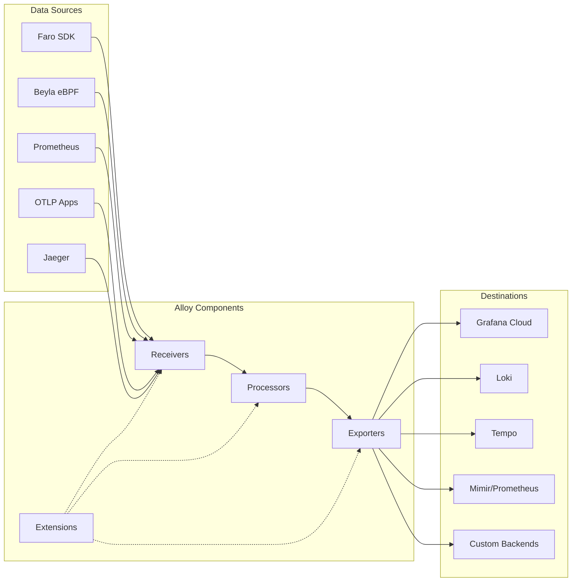

# 🔄 Grafana Alloy - OpenTelemetry Collector Distribution

## 🎯 Visão Geral

O **Grafana Alloy** é uma distribuição de código aberto do OpenTelemetry Collector com pipelines Prometheus integrados, projetado para coletar, transformar e enviar dados de observabilidade de múltiplos ecossistemas.

### 🔑 Características Principais
- **OpenTelemetry Collector** distribution
- **Prometheus pipelines** nativos integrados
- **Multi-protocol support** (OTLP, Prometheus, Jaeger, Zipkin)
- **Data transformation** e enrichment
- **Clustering nativo** para alta disponibilidade
- **Grafana Cloud** e LGTM stack integration

## 🏗️ Arquitetura

### 🔧 **Pipeline Architecture**



### 🎛️ **Component Types**

#### Receivers
- **OTLP**: OpenTelemetry Protocol (gRPC/HTTP)
- **Prometheus**: Metrics scraping
- **Jaeger**: Distributed tracing
- **Zipkin**: Tracing data
- **Loki**: Log aggregation

#### Processors
- **Batch**: Batching para performance
- **Memory Limiter**: Controle de memória
- **Resource**: Enriquecimento de metadados
- **Attributes**: Manipulação de atributos
- **Sampling**: Controle de amostragem

#### Exporters
- **OTLP**: Para backends OpenTelemetry
- **Prometheus**: Para Prometheus/Mimir
- **Loki**: Para agregação de logs
- **Tempo**: Para distributed tracing
- **Grafana Cloud**: Integração nativa

## 📋 Capacidades Detalhadas

### 📊 **Metrics Collection**

#### Prometheus Integration
- **Native scraping** de endpoints Prometheus
- **Service discovery** automático
- **Relabeling** e filtering avançado
- **Remote write** para múltiplos backends

#### OpenTelemetry Metrics
- **OTLP receiver** para métricas
- **Metric transformation** e aggregation
- **Custom metric** generation
- **Multi-backend** export simultâneo

### 📝 **Logs Processing**

#### Log Collection
- **Structured logs** via OTLP
- **Unstructured logs** via file tailing
- **Syslog** e journal integration
- **Container logs** automatic discovery

#### Log Processing
- **Parsing** e structuring
- **Enrichment** com metadata
- **Filtering** e sampling
- **Format conversion** (JSON, logfmt, etc.)

### 🕸️ **Traces Processing**

#### Trace Collection
- **OTLP traces** receiver
- **Jaeger** format support
- **Zipkin** compatibility
- **Custom trace** formats

#### Trace Processing
- **Sampling strategies** configuráveis
- **Span enrichment** com atributos
- **Trace correlation** entre serviços
- **Performance optimization** via batching

### 🔄 **Data Transformation**

#### Processors Available
- **Attributes**: Add, update, delete attributes
- **Resource**: Modify resource information
- **Transform**: Complex data transformations
- **Filter**: Drop unwanted data
- **Groupby**: Aggregate metrics

## ⚙️ Configuração e Setup

### 📦 **Instalação**

#### Via Docker
```bash
# Pull da imagem oficial
docker pull grafana/alloy:latest

# Execução básica
docker run -d \
  --name alloy \
  -p 4317:4317 \
  -p 4318:4318 \
  -p 12345:12345 \
  -v $(pwd)/alloy.yml:/etc/alloy/config.alloy \
  grafana/alloy:latest \
  run /etc/alloy/config.alloy
```

#### Via Binary
```bash
# Download do release
wget https://github.com/grafana/alloy/releases/latest/download/alloy-linux-amd64.zip
unzip alloy-linux-amd64.zip

# Instalação
sudo mv alloy /usr/local/bin/
sudo chmod +x /usr/local/bin/alloy

# Execução
alloy run config.alloy
```

### ⚙️ **Configuração Básica**

```hcl:d%3A%2FREPO%2Fpoc-porto%2Fexamples%2Falloy-config%2Falloy-basic.alloy
// Configuração básica do Grafana Alloy

// OTLP Receiver para traces e métricas
otelcol.receiver.otlp "default" {
  grpc {
    endpoint = "0.0.0.0:4317"
  }
  
  http {
    endpoint = "0.0.0.0:4318"
  }
  
  output {
    metrics = [otelcol.processor.batch.default.input]
    logs    = [otelcol.processor.batch.default.input]
    traces  = [otelcol.processor.batch.default.input]
  }
}

// Batch processor para performance
otelcol.processor.batch "default" {
  timeout = "1s"
  send_batch_size = 1024
  
  output {
    metrics = [otelcol.exporter.otlp.grafana_cloud.input]
    logs    = [otelcol.exporter.otlp.grafana_cloud.input]
    traces  = [otelcol.exporter.otlp.grafana_cloud.input]
  }
}

// Exporter para Grafana Cloud
otelcol.exporter.otlp "grafana_cloud" {
  client {
    endpoint = "https://otlp-gateway-prod-us-central-0.grafana.net/otlp"
    headers = {
      authorization = "Basic " + env("GRAFANA_CLOUD_API_KEY")
    }
  }
}

// Prometheus scraping
prometheus.scrape "default" {
  targets = [
    {"__address__" = "localhost:8080"},
    {"__address__" = "localhost:9090"},
  ]
  
  forward_to = [prometheus.remote_write.grafana_cloud.receiver]
}

// Prometheus remote write
prometheus.remote_write "grafana_cloud" {
  endpoint {
    url = "https://prometheus-prod-01-eu-west-0.grafana.net/api/prom/push"
    basic_auth {
      username = env("GRAFANA_CLOUD_PROMETHEUS_USER")
      password = env("GRAFANA_CLOUD_API_KEY")
    }
  }
}

// Loki logs
loki.source.file "app_logs" {
  targets = [
    {"__path__" = "/var/log/app/*.log", "job" = "app"},
  ]
  
  forward_to = [loki.write.grafana_cloud.receiver]
}

loki.write "grafana_cloud" {
  endpoint {
    url = "https://logs-prod-eu-west-0.grafana.net/loki/api/v1/push"
    basic_auth {
      username = env("GRAFANA_CLOUD_LOKI_USER")
      password = env("GRAFANA_CLOUD_API_KEY")
    }
  }
}
```

### 🎛️ **Configuração Avançada**

```hcl:d%3A%2FREPO%2Fpoc-porto%2Fexamples%2Falloy-config%2Falloy-advanced.alloy
// Configuração avançada do Grafana Alloy

// Service discovery para Kubernetes
discovery.kubernetes "pods" {
  role = "pod"
  
  selectors {
    role  = "pod"
    field = "spec.nodeName=" + env("HOSTNAME")
  }
}

// OTLP Receiver com configurações avançadas
otelcol.receiver.otlp "advanced" {
  grpc {
    endpoint = "0.0.0.0:4317"
    max_recv_msg_size = "32MiB"
    max_concurrent_streams = 16
    read_buffer_size = "512KiB"
    write_buffer_size = "512KiB"
  }
  
  http {
    endpoint = "0.0.0.0:4318"
    max_request_body_size = "32MiB"
    include_metadata = true
  }
  
  output {
    metrics = [otelcol.processor.memory_limiter.default.input]
    logs    = [otelcol.processor.memory_limiter.default.input]
    traces  = [otelcol.processor.memory_limiter.default.input]
  }
}

// Memory limiter para proteção
otelcol.processor.memory_limiter "default" {
  limit_mib = 512
  spike_limit_mib = 128
  check_interval = "5s"
  
  output {
    metrics = [otelcol.processor.resource.default.input]
    logs    = [otelcol.processor.resource.default.input]
    traces  = [otelcol.processor.resource.default.input]
  }
}

// Resource processor para enriquecimento
otelcol.processor.resource "default" {
  attributes {
    insert {
      "deployment.environment" = env("ENVIRONMENT")
      "service.namespace" = "production"
      "k8s.cluster.name" = "my-cluster"
    }
    
    update {
      "service.version" = "v1.2.3"
    }
  }
  
  output {
    metrics = [otelcol.processor.attributes.default.input]
    logs    = [otelcol.processor.attributes.default.input]
    traces  = [otelcol.processor.attributes.default.input]
  }
}

// Attributes processor para limpeza
otelcol.processor.attributes "default" {
  actions {
    action = "delete"
    key = "http.user_agent"
  }
  
  actions {
    action = "update"
    key = "http.url"
    from_attribute = "http.target"
  }
  
  actions {
    action = "insert"
    key = "custom.attribute"
    value = "custom_value"
  }
  
  output {
    metrics = [otelcol.processor.batch.default.input]
    logs    = [otelcol.processor.batch.default.input]
    traces  = [otelcol.processor.batch.default.input]
  }
}

// Batch processor otimizado
otelcol.processor.batch "default" {
  timeout = "200ms"
  send_batch_size = 512
  send_batch_max_size = 1024
  
  output {
    metrics = [
      otelcol.exporter.otlp.grafana_cloud.input,
      otelcol.exporter.prometheus.local.input,
    ]
    logs = [
      otelcol.exporter.otlp.grafana_cloud.input,
      otelcol.exporter.loki.local.input,
    ]
    traces = [
      otelcol.exporter.otlp.grafana_cloud.input,
      otelcol.exporter.jaeger.local.input,
    ]
  }
}

// Múltiplos exporters
otelcol.exporter.otlp "grafana_cloud" {
  client {
    endpoint = "https://otlp-gateway-prod-us-central-0.grafana.net/otlp"
    headers = {
      authorization = "Basic " + env("GRAFANA_CLOUD_API_KEY")
    }
    compression = "gzip"
    timeout = "30s"
  }
  
  retry_on_failure {
    enabled = true
    initial_interval = "5s"
    max_interval = "30s"
    max_elapsed_time = "300s"
  }
  
  sending_queue {
    enabled = true
    num_consumers = 10
    queue_size = 5000
  }
}

otelcol.exporter.prometheus "local" {
  endpoint = "http://prometheus:9090/api/v1/write"
  namespace = "alloy"
  
  resource_to_telemetry_conversion {
    enabled = true
  }
}

otelcol.exporter.loki "local" {
  endpoint = "http://loki:3100/loki/api/v1/push"
  
  default_labels = {
    "job" = "alloy",
    "instance" = env("HOSTNAME"),
  }
}

otelcol.exporter.jaeger "local" {
  endpoint = "http://jaeger:14250"
  tls {
    insecure = true
  }
}

// Prometheus scraping avançado
prometheus.scrape "kubernetes_pods" {
  targets = discovery.kubernetes.pods.targets
  
  scrape_interval = "30s"
  scrape_timeout = "10s"
  metrics_path = "/metrics"
  
  // Relabeling rules
  relabel_configs {
    source_labels = ["__meta_kubernetes_pod_annotation_prometheus_io_scrape"]
    action = "keep"
    regex = "true"
  }
  
  relabel_configs {
    source_labels = ["__meta_kubernetes_pod_annotation_prometheus_io_path"]
    action = "replace"
    target_label = "__metrics_path__"
    regex = "(.+)"
  }
  
  relabel_configs {
    source_labels = ["__address__", "__meta_kubernetes_pod_annotation_prometheus_io_port"]
    action = "replace"
    regex = "([^:]+)(?::\\d+)?;(\\d+)"
    replacement = "$1:$2"
    target_label = "__address__"
  }
  
  forward_to = [
    prometheus.relabel.add_cluster.receiver,
  ]
}

// Prometheus relabeling
prometheus.relabel "add_cluster" {
  rule {
    target_label = "cluster"
    replacement = "production"
  }
  
  rule {
    source_labels = ["__meta_kubernetes_namespace"]
    target_label = "kubernetes_namespace"
  }
  
  rule {
    source_labels = ["__meta_kubernetes_pod_name"]
    target_label = "kubernetes_pod_name"
  }
  
  forward_to = [prometheus.remote_write.multi_backend.receiver]
}

// Multiple remote write endpoints
prometheus.remote_write "multi_backend" {
  endpoint {
    name = "grafana_cloud"
    url = "https://prometheus-prod-01-eu-west-0.grafana.net/api/prom/push"
    basic_auth {
      username = env("GRAFANA_CLOUD_PROMETHEUS_USER")
      password = env("GRAFANA_CLOUD_API_KEY")
    }
    
    queue_config {
      capacity = 10000
      max_shards = 50
      min_shards = 1
      max_samples_per_send = 2000
      batch_send_deadline = "5s"
    }
  }
  
  endpoint {
    name = "local_prometheus"
    url = "http://prometheus:9090/api/v1/write"
    
    queue_config {
      capacity = 5000
      max_shards = 10
    }
  }
}

// Loki log processing
loki.source.kubernetes "pod_logs" {
  targets = discovery.kubernetes.pods.targets
  
  forward_to = [loki.process.parse_logs.receiver]
}

loki.process "parse_logs" {
  // JSON parsing
  stage.json {
    expressions = {
      level = "level",
      message = "msg",
      timestamp = "ts",
    }
  }
  
  // Label extraction
  stage.labels {
    values = {
      level = "level",
    }
  }
  
  // Timestamp parsing
  stage.timestamp {
    source = "timestamp"
    format = "RFC3339"
  }
  
  // Output formatting
  stage.output {
    source = "message"
  }
  
  forward_to = [loki.write.multi_backend.receiver]
}

loki.write "multi_backend" {
  endpoint {
    url = "https://logs-prod-eu-west-0.grafana.net/loki/api/v1/push"
    basic_auth {
      username = env("GRAFANA_CLOUD_LOKI_USER")
      password = env("GRAFANA_CLOUD_API_KEY")
    }
  }
  
  endpoint {
    url = "http://loki:3100/loki/api/v1/push"
  }
}

// Health check endpoint
otelcol.extension.health_check "default" {
  endpoint = "0.0.0.0:13133"
  path = "/health"
}

// Performance profiling
otelcol.extension.pprof "default" {
  endpoint = "0.0.0.0:1777"
}

// Zpages for debugging
otelcol.extension.zpages "default" {
  endpoint = "0.0.0.0:55679"
}
```

## 🚀 Deployment Scenarios

### 🐳 **Docker Compose Stack**

```yaml:d%3A%2FREPO%2Fpoc-porto%2Fdocker%2Falloy%2Fdocker-compose.yml
version: '3.8'

services:
  # Grafana Alloy
  alloy:
    image: grafana/alloy:latest
    container_name: alloy
    ports:
      - "4317:4317"    # OTLP gRPC
      - "4318:4318"    # OTLP HTTP
      - "12345:12345"  # Alloy UI
      - "9090:9090"    # Prometheus metrics
    volumes:
      - ./alloy.alloy:/etc/alloy/config.alloy:ro
      - ./data/alloy:/var/lib/alloy
    environment:
      - GRAFANA_CLOUD_API_KEY=${GRAFANA_CLOUD_API_KEY}
      - GRAFANA_CLOUD_PROMETHEUS_USER=${GRAFANA_CLOUD_PROMETHEUS_USER}
      - GRAFANA_CLOUD_LOKI_USER=${GRAFANA_CLOUD_LOKI_USER}
      - ENVIRONMENT=production
    command:
      - run
      - /etc/alloy/config.alloy
      - --server.http.listen-addr=0.0.0.0:12345
      - --storage.path=/var/lib/alloy
    restart: unless-stopped
    
  # Local Prometheus (opcional)
  prometheus:
    image: prom/prometheus:latest
    container_name: prometheus
    ports:
      - "9091:9090"
    volumes:
      - ./prometheus.yml:/etc/prometheus/prometheus.yml:ro
      - prometheus_data:/prometheus
    command:
      - '--config.file=/etc/prometheus/prometheus.yml'
      - '--storage.tsdb.path=/prometheus'
      - '--web.console.libraries=/etc/prometheus/console_libraries'
      - '--web.console.templates=/etc/prometheus/consoles'
      - '--web.enable-lifecycle'
      - '--web.enable-remote-write-receiver'
    restart: unless-stopped
    
  # Local Loki (opcional)
  loki:
    image: grafana/loki:latest
    container_name: loki
    ports:
      - "3100:3100"
    volumes:
      - ./loki.yml:/etc/loki/local-config.yaml:ro
      - loki_data:/loki
    command: -config.file=/etc/loki/local-config.yaml
    restart: unless-stopped
    
  # Local Tempo (opcional)
  tempo:
    image: grafana/tempo:latest
    container_name: tempo
    ports:
      - "3200:3200"   # Tempo HTTP
      - "14250:14250" # Jaeger gRPC
    volumes:
      - ./tempo.yml:/etc/tempo.yaml:ro
      - tempo_data:/var/tempo
    command:
      - -config.file=/etc/tempo.yaml
    restart: unless-stopped
    
  # Grafana Dashboard
  grafana:
    image: grafana/grafana:latest
    container_name: grafana
    ports:
      - "3000:3000"
    volumes:
      - grafana_data:/var/lib/grafana
      - ./grafana/provisioning:/etc/grafana/provisioning:ro
    environment:
      - GF_SECURITY_ADMIN_PASSWORD=admin
      - GF_FEATURE_TOGGLES_ENABLE=traceqlEditor
    restart: unless-stopped

volumes:
  prometheus_data:
  loki_data:
  tempo_data:
  grafana_data:

networks:
  default:
    name: observability
```

### ☸️ **Kubernetes Deployment**

```yaml:d%3A%2FREPO%2Fpoc-porto%2Fexamples%2Falloy-config%2Fk8s-deployment.yml
apiVersion: v1
kind: ConfigMap
metadata:
  name: alloy-config
  namespace: observability
data:
  config.alloy: |
    // Kubernetes-specific Alloy configuration
    discovery.kubernetes "pods" {
      role = "pod"
    }
    
    discovery.kubernetes "services" {
      role = "service"
    }
    
    otelcol.receiver.otlp "default" {
      grpc {
        endpoint = "0.0.0.0:4317"
      }
      http {
        endpoint = "0.0.0.0:4318"
      }
      output {
        metrics = [otelcol.processor.batch.default.input]
        logs    = [otelcol.processor.batch.default.input]
        traces  = [otelcol.processor.batch.default.input]
      }
    }
    
    otelcol.processor.batch "default" {
      output {
        metrics = [otelcol.exporter.otlp.grafana_cloud.input]
        logs    = [otelcol.exporter.otlp.grafana_cloud.input]
        traces  = [otelcol.exporter.otlp.grafana_cloud.input]
      }
    }
    
    otelcol.exporter.otlp "grafana_cloud" {
      client {
        endpoint = env("GRAFANA_CLOUD_OTLP_ENDPOINT")
        headers = {
          authorization = "Basic " + env("GRAFANA_CLOUD_API_KEY")
        }
      }
    }
---
apiVersion: apps/v1
kind: Deployment
metadata:
  name: alloy
  namespace: observability
spec:
  replicas: 2
  selector:
    matchLabels:
      app: alloy
  template:
    metadata:
      labels:
        app: alloy
    spec:
      serviceAccountName: alloy
      containers:
      - name: alloy
        image: grafana/alloy:latest
        ports:
        - containerPort: 4317
          name: otlp-grpc
        - containerPort: 4318
          name: otlp-http
        - containerPort: 12345
          name: http
        env:
        - name: GRAFANA_CLOUD_API_KEY
          valueFrom:
            secretKeyRef:
              name: grafana-cloud
              key: api-key
        - name: GRAFANA_CLOUD_OTLP_ENDPOINT
          value: "https://otlp-gateway-prod-us-central-0.grafana.net/otlp"
        volumeMounts:
        - name: config
          mountPath: /etc/alloy
        - name: data
          mountPath: /var/lib/alloy
        args:
        - run
        - /etc/alloy/config.alloy
        - --server.http.listen-addr=0.0.0.0:12345
        - --storage.path=/var/lib/alloy
        - --cluster.enabled=true
        - --cluster.join-addresses=alloy-headless:9095
        resources:
          requests:
            memory: "256Mi"
            cpu: "100m"
          limits:
            memory: "1Gi"
            cpu: "500m"
        livenessProbe:
          httpGet:
            path: /-/healthy
            port: 12345
          initialDelaySeconds: 30
          periodSeconds: 30
        readinessProbe:
          httpGet:
            path: /-/ready
            port: 12345
          initialDelaySeconds: 5
          periodSeconds: 10
      volumes:
      - name: config
        configMap:
          name: alloy-config
      - name: data
        emptyDir: {}
---
apiVersion: v1
kind: Service
metadata:
  name: alloy
  namespace: observability
spec:
  selector:
    app: alloy
  ports:
  - name: otlp-grpc
    port: 4317
    targetPort: 4317
  - name: otlp-http
    port: 4318
    targetPort: 4318
  - name: http
    port: 12345
    targetPort: 12345
---
apiVersion: v1
kind: Service
metadata:
  name: alloy-headless
  namespace: observability
spec:
  clusterIP: None
  selector:
    app: alloy
  ports:
  - name: clustering
    port: 9095
    targetPort: 9095
---
apiVersion: v1
kind: ServiceAccount
metadata:
  name: alloy
  namespace: observability
---
apiVersion: rbac.authorization.k8s.io/v1
kind: ClusterRole
metadata:
  name: alloy
rules:
- apiGroups: [""]
  resources: ["pods", "services", "endpoints", "nodes"]
  verbs: ["get", "list", "watch"]
- apiGroups: ["apps"]
  resources: ["deployments", "replicasets"]
  verbs: ["get", "list", "watch"]
---
apiVersion: rbac.authorization.k8s.io/v1
kind: ClusterRoleBinding
metadata:
  name: alloy
roleRef:
  apiGroup: rbac.authorization.k8s.io
  kind: ClusterRole
  name: alloy
subjects:
- kind: ServiceAccount
  name: alloy
  namespace: observability
```

## 📊 Monitoring e Observabilidade

### 📈 **Métricas do Alloy**

```promql
# Pipeline throughput
sum(rate(otelcol_receiver_accepted_metric_points_total[5m])) by (receiver)

# Error rates
sum(rate(otelcol_exporter_send_failed_metric_points_total[5m])) by (exporter)

# Queue sizes
otelcol_exporter_queue_size by (exporter)

# Memory usage
process_resident_memory_bytes{job="alloy"}

# CPU usage
rate(process_cpu_seconds_total{job="alloy"}[5m])
```

### 🎯 **Dashboards Grafana**

```json:d%3A%2FREPO%2Fpoc-porto%2Fexamples%2Falloy-config%2Fgrafana-dashboard.json
{
  "dashboard": {
    "title": "Grafana Alloy - Pipeline Monitoring",
    "panels": [
      {
        "title": "Data Ingestion Rate",
        "type": "stat",
        "targets": [
          {
            "expr": "sum(rate(otelcol_receiver_accepted_metric_points_total[5m]))",
            "legendFormat": "Metrics/sec"
          },
          {
            "expr": "sum(rate(otelcol_receiver_accepted_log_records_total[5m]))",
            "legendFormat": "Logs/sec"
          },
          {
            "expr": "sum(rate(otelcol_receiver_accepted_spans_total[5m]))",
            "legendFormat": "Spans/sec"
          }
        ]
      },
      {
        "title": "Export Success Rate",
        "type": "stat",
        "targets": [
          {
            "expr": "sum(rate(otelcol_exporter_sent_metric_points_total[5m])) / sum(rate(otelcol_receiver_accepted_metric_points_total[5m])) * 100"
          }
        ]
      },
      {
        "title": "Queue Sizes",
        "type": "graph",
        "targets": [
          {
            "expr": "otelcol_exporter_queue_size",
            "legendFormat": "{{exporter}}"
          }
        ]
      },
      {
        "title": "Memory Usage",
        "type": "graph",
        "targets": [
          {
            "expr": "process_resident_memory_bytes{job=\"alloy\"}",
            "legendFormat": "RSS Memory"
          }
        ]
      }
    ]
  }
}
```

## 🔧 Troubleshooting

### 🐛 **Problemas Comuns**

#### Pipeline não funciona
```bash
# Verificar configuração
alloy fmt config.alloy

# Validar sintaxe
alloy validate config.alloy

# Debug mode
alloy run config.alloy --log.level=debug
```

#### Dados não chegam ao destino
```bash
# Verificar conectividade
curl -v http://alloy:4318/v1/traces

# Verificar logs
docker logs alloy

# Verificar métricas internas
curl http://alloy:12345/metrics
```

#### Performance issues
```bash
# Verificar queue sizes
curl -s http://alloy:12345/metrics | grep queue_size

# Verificar memory usage
curl -s http://alloy:12345/metrics | grep memory

# Verificar CPU usage
top -p $(pgrep alloy)
```

### 📋 **Configuração de Debug**

```hcl
// Debug configuration
logging {
  level = "debug"
  format = "json"
}

// Enable profiling
otelcol.extension.pprof "debug" {
  endpoint = "0.0.0.0:1777"
}

// Enable zpages
otelcol.extension.zpages "debug" {
  endpoint = "0.0.0.0:55679"
}

// Health check
otelcol.extension.health_check "debug" {
  endpoint = "0.0.0.0:13133"
}
```

## ⚡ Performance e Otimização

### 📊 **Benchmarks**

| Componente | Throughput | Latency | Memory |
|------------|------------|---------|--------|
| **OTLP Receiver** | 100k spans/s | <1ms | 200MB |
| **Batch Processor** | 500k items/s | <5ms | 50MB |
| **OTLP Exporter** | 50k spans/s | <10ms | 100MB |
| **Prometheus Scraper** | 1M samples/s | <100ms | 300MB |

### 🎛️ **Otimizações**

```hcl
// High-performance configuration
otelcol.receiver.otlp "optimized" {
  grpc {
    endpoint = "0.0.0.0:4317"
    max_recv_msg_size = "32MiB"
    max_concurrent_streams = 32
    keepalive {
      server_parameters {
        time = "30s"
        timeout = "5s"
      }
      enforcement_policy {
        min_time = "10s"
        permit_without_stream = true
      }
    }
  }
  
  output {
    metrics = [otelcol.processor.batch.optimized.input]
    logs    = [otelcol.processor.batch.optimized.input]
    traces  = [otelcol.processor.batch.optimized.input]
  }
}

otelcol.processor.batch "optimized" {
  timeout = "100ms"
  send_batch_size = 2048
  send_batch_max_size = 4096
  
  output {
    metrics = [otelcol.exporter.otlp.optimized.input]
    logs    = [otelcol.exporter.otlp.optimized.input]
    traces  = [otelcol.exporter.otlp.optimized.input]
  }
}

otelcol.exporter.otlp "optimized" {
  client {
    endpoint = "https://otlp-gateway.grafana.net/otlp"
    compression = "gzip"
    timeout = "10s"
    headers = {
      authorization = "Basic " + env("GRAFANA_CLOUD_API_KEY")
    }
  }
  
  sending_queue {
    enabled = true
    num_consumers = 20
    queue_size = 10000
  }
  
  retry_on_failure {
    enabled = true
    initial_interval = "1s"
    max_interval = "30s"
    max_elapsed_time = "300s"
  }
}
```

## 🔄 Integração com Faro e Beyla

### 🌐 **Faro → Alloy → Grafana Cloud**

```hcl
// Configuração para receber dados do Faro
otelcol.receiver.otlp "faro" {
  grpc {
    endpoint = "0.0.0.0:4317"
  }
  
  http {
    endpoint = "0.0.0.0:4318"
    cors {
      allowed_origins = ["*"]
      allowed_headers = ["*"]
    }
  }
  
  output {
    metrics = [otelcol.processor.resource.faro.input]
    logs    = [otelcol.processor.resource.faro.input]
    traces  = [otelcol.processor.resource.faro.input]
  }
}

// Enriquecimento específico para Faro
otelcol.processor.resource "faro" {
  attributes {
    insert {
      "telemetry.sdk.name" = "faro"
      "source" = "frontend"
    }
  }
  
  output {
    metrics = [otelcol.processor.batch.default.input]
    logs    = [otelcol.processor.batch.default.input]
    traces  = [otelcol.processor.batch.default.input]
  }
}
```

### ⚡ **Beyla → Alloy → Grafana Cloud**

```hcl
// Configuração para receber dados do Beyla
otelcol.receiver.otlp "beyla" {
  grpc {
    endpoint = "0.0.0.0:4317"
  }
  
  output {
    metrics = [otelcol.processor.resource.beyla.input]
    traces  = [otelcol.processor.resource.beyla.input]
  }
}

// Enriquecimento específico para Beyla
otelcol.processor.resource "beyla" {
  attributes {
    insert {
      "telemetry.sdk.name" = "beyla"
      "source" = "ebpf"
      "instrumentation.type" = "auto"
    }
  }
  
  output {
    metrics = [otelcol.processor.batch.default.input]
    traces  = [otelcol.processor.batch.default.input]
  }
}
```

## 🎯 Casos de Uso

### 🏢 **Enterprise Observability**
- **Centralized data collection** de múltiplas fontes
- **Data transformation** e enrichment
- **Multi-tenant** data routing
- **Compliance** e data governance

### ☁️ **Hybrid Cloud**
- **On-premises** to cloud data shipping
- **Multi-cloud** observability
- **Edge computing** data aggregation
- **Cost optimization** via sampling

### 🔄 **Migration Scenarios**
- **Gradual migration** de ferramentas legadas
- **Protocol translation** (Jaeger → OTLP)
- **Vendor neutrality** com OpenTelemetry
- **A/B testing** de backends

## 📚 Recursos Adicionais

### 🔗 **Links Úteis**
- [Documentação Oficial](https://grafana.com/docs/alloy/)
- [GitHub Repository](https://github.com/grafana/alloy)
- [OpenTelemetry Collector](https://opentelemetry.io/docs/collector/)
- [Grafana Cloud Integration](https://grafana.com/docs/grafana-cloud/monitor-applications/)

### 🎓 **Tutoriais**
- [Getting Started with Alloy](https://grafana.com/tutorials/alloy-getting-started/)
- [Kubernetes Deployment](https://grafana.com/docs/alloy/latest/set-up/deploy-kubernetes/)
- [Configuration Examples](https://grafana.com/docs/alloy/latest/reference/)

---

**Próximo:** [Comparativo de Capacidades →](./04-comparativo.md)