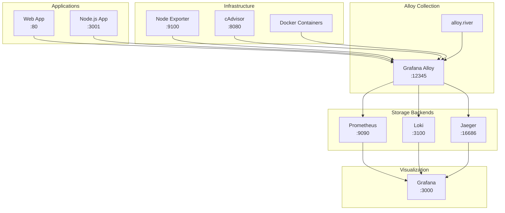

# Grafana Alloy - Centralized Observability Collection

Este exemplo demonstra como usar o **Grafana Alloy** para centralizar a coleta de dados de observabilidade de múltiplas fontes, incluindo métricas, logs e traces.

## 📋 Visão Geral

O Grafana Alloy é um coletor de dados de observabilidade altamente configurável que pode:
- Coletar métricas de múltiplas fontes (Prometheus, OTLP, StatsD)
- Processar e transformar dados antes do armazenamento
- Rotear dados para diferentes backends (Prometheus, Loki, Jaeger)
- Descobrir serviços automaticamente
- Aplicar filtros e transformações

## 🏗️ Arquitetura



## 🚀 Início Rápido

### Pré-requisitos

- Docker e Docker Compose
- 8GB+ de RAM disponível
- Portas disponíveis: 80, 3000, 3001, 3100, 9090, 9100, 12345, 16686

### Iniciando o Ambiente

#### Linux/macOS
```bash
# Tornar o script executável
chmod +x scripts/start-alloy.sh

# Iniciar o ambiente
./scripts/start-alloy.sh
```

#### Windows (PowerShell)
```powershell
# Executar o script
.\scripts\start-alloy.ps1

# Ou pular verificações de saúde para início mais rápido
.\scripts\start-alloy.ps1 -SkipHealthChecks
```

#### Docker Compose Direto
```bash
# Iniciar todos os serviços
docker-compose up -d

# Verificar status
docker-compose ps

# Ver logs do Alloy
docker-compose logs -f alloy
```

## 🌐 URLs de Acesso

| Serviço | URL | Credenciais |
|---------|-----|-------------|
| **Grafana** | http://localhost:3000 | admin/admin |
| **Alloy UI** | http://localhost:12345 | - |
| **Prometheus** | http://localhost:9090 | - |
| **Loki** | http://localhost:3100 | - |
| **Jaeger** | http://localhost:16686 | - |
| **Web App** | http://localhost:80 | - |
| **Node.js App** | http://localhost:3001 | - |
| **Node Exporter** | http://localhost:9100/metrics | - |
| **cAdvisor** | http://localhost:8080 | - |

## 📊 Fontes de Dados Coletadas

### 1. Métricas de Aplicação
- **Web App (Nginx)**: Métricas HTTP, taxa de requisições, latência
- **Node.js App**: Métricas customizadas, performance, business metrics
- **Alloy**: Métricas internas do próprio coletor

### 2. Métricas de Infraestrutura
- **Node Exporter**: CPU, memória, disco, rede do host
- **cAdvisor**: Métricas de containers Docker
- **Docker**: Logs de containers

### 3. Logs
- **Application Logs**: Logs estruturados das aplicações
- **Container Logs**: Logs de todos os containers Docker
- **System Logs**: Logs do sistema operacional

### 4. Traces
- **Distributed Tracing**: Traces OTLP das aplicações
- **HTTP Traces**: Rastreamento de requisições HTTP

## ⚙️ Configuração do Alloy

### Arquivo Principal: `alloy.river`

O Alloy usa a linguagem River para configuração:

```river
// Coleta métricas do próprio Alloy
prometheus.scrape "alloy" {
  targets = [{
    __address__ = "localhost:12345",
    job         = "alloy",
  }]
  forward_to = [prometheus.remote_write.default.receiver]
}

// Recebe dados OTLP
otelcol.receiver.otlp "default" {
  grpc {
    endpoint = "0.0.0.0:4317"
  }
  http {
    endpoint = "0.0.0.0:4318"
  }
  output {
    metrics = [otelcol.processor.batch.default.input]
    logs    = [otelcol.processor.batch.default.input]
    traces  = [otelcol.processor.batch.default.input]
  }
}

// Exporta para Prometheus
prometheus.remote_write "default" {
  endpoint {
    url = "http://prometheus:9090/api/v1/write"
  }
}
```

### Descoberta de Serviços

O arquivo `targets/services.json` define os alvos para descoberta:

```json
[
  {
    "targets": ["web-app:80"],
    "labels": {
      "job": "web-app",
      "environment": "development",
      "service": "nginx"
    }
  },
  {
    "targets": ["node-app:3001"],
    "labels": {
      "job": "node-app",
      "environment": "development",
      "service": "nodejs"
    }
  }
]
```

## 🧪 Gerando Tráfego

### Interface Web
1. Acesse http://localhost:80
2. Use os botões para testar diferentes endpoints
3. Execute o "Load Test" para gerar tráfego em massa

### Scripts de Carga
```bash
# Linux/macOS
./scripts/load-generator.sh

# Windows
.\scripts\load-generator.ps1
```

### Comandos Manuais
```bash
# Teste rápido
curl http://localhost:80/api/fast

# Teste lento
curl http://localhost:80/api/slow

# Teste de erro
curl http://localhost:80/api/error/500

# Node.js app
curl http://localhost:3001/api/users
```

## 📈 Dashboards e Métricas

### Dashboards Disponíveis
1. **Alloy Overview**: Visão geral do coletor
2. **Infrastructure Monitoring**: Métricas de infraestrutura
3. **Application Performance**: Performance das aplicações
4. **Container Metrics**: Métricas de containers

### Métricas Importantes

#### Métricas do Alloy
```promql
# Taxa de ingestão de métricas
rate(alloy_prometheus_fanout_samples_total[5m])

# Uso de memória do Alloy
process_resident_memory_bytes{job="alloy"}

# Componentes ativos
alloy_build_info
```

#### Métricas de Aplicação
```promql
# Taxa de requisições HTTP
rate(nginx_http_requests_total[5m])

# Latência P95
histogram_quantile(0.95, rate(http_request_duration_seconds_bucket[5m]))

# Taxa de erro
rate(nginx_http_requests_total{status=~"5.."}[5m]) / rate(nginx_http_requests_total[5m])
```

#### Métricas de Infraestrutura
```promql
# CPU usage
100 - (avg by (instance) (rate(node_cpu_seconds_total{mode="idle"}[5m])) * 100)

# Memory usage
(1 - (node_memory_MemAvailable_bytes / node_memory_MemTotal_bytes)) * 100

# Container CPU
rate(container_cpu_usage_seconds_total[5m]) * 100
```

## 🔧 Personalização

### Adicionando Novos Coletores

1. **Edite `alloy.river`**:
```river
// Novo coletor de métricas
prometheus.scrape "my_service" {
  targets = [{
    __address__ = "my-service:8080",
    job         = "my-service",
  }]
  forward_to = [prometheus.remote_write.default.receiver]
}
```

2. **Atualize `targets/services.json`**:
```json
{
  "targets": ["my-service:8080"],
  "labels": {
    "job": "my-service",
    "environment": "development"
  }
}
```

### Configurando Filtros

```river
// Filtrar métricas por nome
prometheus.relabel "filter_metrics" {
  forward_to = [prometheus.remote_write.default.receiver]
  
  rule {
    source_labels = ["__name__"]
    regex         = "(http_.*|cpu_.*|memory_.*)"
    action        = "keep"
  }
}
```

### Transformações de Labels

```river
// Adicionar labels customizados
prometheus.relabel "add_labels" {
  forward_to = [prometheus.remote_write.default.receiver]
  
  rule {
    target_label = "environment"
    replacement  = "production"
  }
  
  rule {
    target_label = "team"
    replacement  = "platform"
  }
}
```

## 🔍 Troubleshooting

### Verificar Status dos Serviços
```bash
# Status geral
docker-compose ps

# Logs do Alloy
docker-compose logs -f alloy

# Logs de um serviço específico
docker-compose logs -f prometheus
```

### Verificar Configuração do Alloy
```bash
# Ver configuração atual
docker-compose exec alloy cat /etc/alloy/alloy.river

# Verificar status da UI
curl http://localhost:12345/-/healthy
```

### Problemas Comuns

#### 1. Alloy não está coletando métricas
- Verifique se os targets estão acessíveis
- Confirme a configuração em `alloy.river`
- Verifique logs: `docker-compose logs alloy`

#### 2. Métricas não aparecem no Prometheus
- Verifique a configuração de `remote_write`
- Confirme conectividade: `curl http://localhost:9090/-/healthy`
- Verifique targets no Prometheus UI

#### 3. Dashboards vazios no Grafana
- Confirme que os datasources estão configurados
- Verifique se há dados no Prometheus: `curl http://localhost:9090/api/v1/label/__name__/values`
- Importe os dashboards manualmente se necessário

### Comandos de Debug

```bash
# Verificar métricas disponíveis
curl http://localhost:9090/api/v1/label/__name__/values | jq

# Testar query PromQL
curl 'http://localhost:9090/api/v1/query?query=up'

# Verificar targets do Prometheus
curl http://localhost:9090/api/v1/targets

# Status do Alloy
curl http://localhost:12345/api/v0/web/components
```

## 🚀 Casos de Uso Avançados

### 1. Monitoramento Multi-Tenant

```river
// Separar métricas por tenant
prometheus.relabel "tenant_routing" {
  forward_to = [prometheus.remote_write.tenant_a.receiver, prometheus.remote_write.tenant_b.receiver]
  
  rule {
    source_labels = ["tenant"]
    regex         = "tenant-a"
    target_label  = "__tmp_tenant_a"
    replacement   = "true"
  }
}

prometheus.remote_write "tenant_a" {
  endpoint {
    url = "http://prometheus-tenant-a:9090/api/v1/write"
  }
}
```

### 2. Agregação de Métricas

```river
// Agregar métricas antes do envio
prometheus.recording_rule "aggregations" {
  rule {
    record = "http_requests_per_second"
    expr   = "rate(http_requests_total[5m])"
  }
  
  rule {
    record = "http_error_rate"
    expr   = "rate(http_requests_total{status=~'5..'}[5m]) / rate(http_requests_total[5m])"
  }
}
```

### 3. Alerting Integration

```river
// Enviar métricas para Alertmanager
prometheus.remote_write "alerting" {
  endpoint {
    url = "http://alertmanager:9093/api/v1/write"
  }
  
  // Apenas métricas críticas
  write_relabel_config {
    source_labels = ["__name__"]
    regex         = "(up|http_error_rate|cpu_usage)"
    action        = "keep"
  }
}
```

## 📚 Recursos Adicionais

### Documentação
- [Grafana Alloy Documentation](https://grafana.com/docs/alloy/)
- [River Language Reference](https://grafana.com/docs/alloy/latest/reference/)
- [OpenTelemetry Integration](https://grafana.com/docs/alloy/latest/reference/components/otelcol/)

### Exemplos de Configuração
- [Alloy Examples Repository](https://github.com/grafana/alloy/tree/main/example)
- [Community Configurations](https://github.com/grafana/alloy-configurator)

### Comunidade
- [Grafana Community Forum](https://community.grafana.com/)
- [Slack Channel](https://grafana.slack.com/)
- [GitHub Issues](https://github.com/grafana/alloy/issues)

## 🧹 Limpeza

### Parar e Remover Containers
```bash
# Parar todos os serviços
docker-compose down

# Remover volumes (CUIDADO: apaga dados)
docker-compose down -v

# Limpeza completa
docker-compose down -v --remove-orphans
docker system prune -f
```

### Remover Imagens
```bash
# Remover imagens do projeto
docker-compose down --rmi all

# Limpeza geral de imagens não utilizadas
docker image prune -a
```

---

**🎯 Próximos Passos**: Após explorar este exemplo, considere implementar o Alloy em seu ambiente de produção com configurações específicas para suas necessidades de observabilidade.