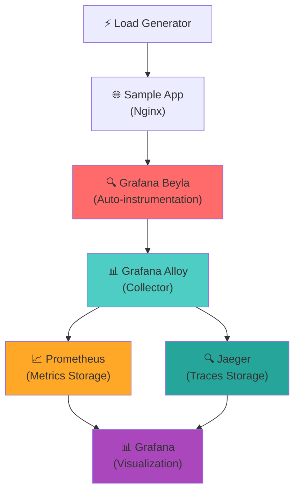

# Grafana Beyla - Coleta Automática de Métricas

> **Beyla** é um instrumentador automático de aplicações que coleta métricas RED (Rate, Errors, Duration) sem necessidade de modificar o código da aplicação.

## 📋 Visão Geral

Este exemplo demonstra como usar o **Grafana Beyla** para:

- ✅ **Coleta automática** de métricas HTTP, gRPC e de banco de dados
- ✅ **Zero instrumentação** - sem modificar código da aplicação
- ✅ **Métricas RED** completas (Rate, Errors, Duration)
- ✅ **Traces distribuídos** automáticos
- ✅ **Integração** com Prometheus, Grafana e Jaeger
- ✅ **Descoberta automática** de serviços

## 🏗️ Arquitetura



## 🚀 Início Rápido

### Pré-requisitos

- **Docker** e **Docker Compose** instalados
- **8GB RAM** disponível (recomendado)
- **Portas livres**: 3000, 8080, 9090, 12345, 16686

### 1. Iniciar o Ambiente

#### Linux/macOS:
```bash
# Dar permissão de execução
chmod +x scripts/start-monitoring.sh

# Iniciar ambiente
./scripts/start-monitoring.sh

# Ou com limpeza completa
./scripts/start-monitoring.sh --clean
```

#### Windows (PowerShell):
```powershell
# Executar como Administrador
.\scripts\start-monitoring.ps1

# Ou com limpeza completa
.\scripts\start-monitoring.ps1 -Clean
```

#### Docker Compose Manual:
```bash
# Iniciar todos os serviços
docker-compose up -d

# Verificar status
docker-compose ps

# Ver logs
docker-compose logs -f beyla
```

### 2. Acessar as Interfaces

| Serviço | URL | Credenciais |
|---------|-----|-------------|
| **Aplicação de Exemplo** | http://localhost:8080 | - |
| **Grafana** | http://localhost:3000 | admin/admin |
| **Prometheus** | http://localhost:9090 | - |
| **Alloy UI** | http://localhost:12345 | - |
| **Jaeger** | http://localhost:16686 | - |

### 3. Gerar Tráfego

A aplicação de exemplo já inclui um gerador de carga automático, mas você pode gerar tráfego adicional:

```bash
# Requisições normais
curl http://localhost:8080/api/users
curl http://localhost:8080/api/products

# Testar diferentes cenários
curl http://localhost:8080/api/slow        # Resposta lenta
curl http://localhost:8080/api/error       # Erro 500
curl http://localhost:8080/nonexistent     # Erro 404
```

## 📊 Dashboards e Métricas

### Dashboard Principal: Beyla RED Metrics

**URL**: http://localhost:3000/d/beyla-red-overview

**Métricas Incluídas**:

#### 🔢 Rate (Taxa de Requisições)
```promql
# Requisições por segundo por serviço
sum(rate(http_server_request_duration_seconds_count[5m])) by (service_name)
```

#### ❌ Errors (Taxa de Erro)
```promql
# Porcentagem de erros 5xx
sum(rate(http_server_request_duration_seconds_count{http_status_code=~"5.."}[5m])) by (service_name) / 
sum(rate(http_server_request_duration_seconds_count[5m])) by (service_name)
```

#### ⏱️ Duration (Latência)
```promql
# Percentis de latência
histogram_quantile(0.95, sum(rate(http_server_request_duration_seconds_bucket[5m])) by (service_name, le))
```

### Métricas Coletadas Automaticamente

| Tipo | Métrica | Descrição |
|------|---------|-----------|
| **HTTP** | `http_server_request_duration_seconds` | Duração das requisições HTTP |
| **HTTP** | `http_client_request_duration_seconds` | Duração das requisições HTTP de saída |
| **gRPC** | `rpc_server_duration_seconds` | Duração das chamadas gRPC |
| **Database** | `db_client_operation_duration_seconds` | Duração das operações de banco |
| **System** | `process_cpu_seconds_total` | Uso de CPU do processo |
| **System** | `process_resident_memory_bytes` | Uso de memória do processo |

## ⚙️ Configuração

### Arquivo de Configuração Beyla

**Localização**: `beyla.yml`

```yaml
# Descoberta de serviços
discovery:
  services:
    - port: 80              # Monitorar aplicações na porta 80
    - process_name: "nginx"  # Monitorar processos nginx
    - k8s_namespace: "default" # Descoberta Kubernetes

# Instrumentação
instrumentation:
  http:
    enabled: true
  grpc:
    enabled: true
  database:
    enabled: true

# Exportação de métricas
prometheus:
  port: 8999
  path: "/metrics"

# Exportação de traces
otlp:
  endpoint: "http://alloy:4317"
```

### Personalização

#### Monitorar Aplicação Específica

1. **Por Porta**:
```yaml
discovery:
  services:
    - port: 3000  # Sua aplicação Node.js
    - port: 8000  # Sua aplicação Python
```

2. **Por Nome do Processo**:
```yaml
discovery:
  services:
    - process_name: "node"
    - process_name: "python"
```

3. **Por PID**:
```yaml
discovery:
  services:
    - pid: 1234
```

#### Filtros e Labels

```yaml
# Adicionar labels customizados
attributes:
  instance_id: "prod-server-01"
  environment: "production"
  team: "backend"

# Filtrar rotas
routes:
  patterns:
    - "/api/v1/users/{id}"
    - "/api/v1/products/{id}"
  ignore:
    - "/health"
    - "/metrics"
```

## 🔍 Troubleshooting

### Verificar Status dos Serviços

```bash
# Status geral
docker-compose ps

# Logs do Beyla
docker-compose logs -f beyla

# Logs de todos os serviços
docker-compose logs -f
```

### Problemas Comuns

#### 1. Beyla não detecta a aplicação

**Sintomas**: Sem métricas no Prometheus

**Soluções**:
```bash
# Verificar se a aplicação está rodando na porta correta
netstat -tlnp | grep :80

# Verificar logs do Beyla
docker-compose logs beyla | grep -i "discovered"

# Verificar configuração
cat beyla.yml | grep -A 5 "discovery"
```

#### 2. Métricas não aparecem no Grafana

**Verificações**:
1. Prometheus está coletando métricas: http://localhost:9090/targets
2. Alloy está funcionando: http://localhost:12345
3. Datasource configurado no Grafana

#### 3. Traces não aparecem no Jaeger

**Verificações**:
```bash
# Verificar se Alloy está enviando traces
curl http://localhost:12345/metrics | grep otlp

# Verificar Jaeger
curl http://localhost:16686/api/services
```

### Comandos de Debug

```bash
# Verificar métricas do Beyla diretamente
curl http://localhost:8999/metrics

# Verificar se Alloy está recebendo dados
curl http://localhost:12345/metrics | grep beyla

# Verificar targets do Prometheus
curl http://localhost:9090/api/v1/targets

# Testar conectividade
docker-compose exec beyla ping alloy
docker-compose exec alloy ping prometheus
```

## 🎯 Casos de Uso

### 1. Monitoramento de Aplicação Existente

```yaml
# beyla-custom.yml
discovery:
  services:
    - port: 8080  # Sua aplicação
    
attributes:
  service_name: "minha-api"
  environment: "production"
  version: "v1.2.3"
```

### 2. Monitoramento Multi-Serviço

```yaml
discovery:
  services:
    - port: 3000
      service_name: "frontend"
    - port: 8080
      service_name: "api-gateway"
    - port: 5432
      service_name: "database"
```

### 3. Ambiente Kubernetes

```yaml
discovery:
  services:
    - k8s_namespace: "production"
    - k8s_pod_name: "api-*"
    - k8s_service_name: "user-service"
```

## 📈 Métricas Avançadas

### Queries Prometheus Úteis

```promql
# Top 5 endpoints mais lentos
topk(5, histogram_quantile(0.95, 
  sum(rate(http_server_request_duration_seconds_bucket[5m])) 
  by (http_route, le)
))

# Taxa de erro por endpoint
sum(rate(http_server_request_duration_seconds_count{http_status_code=~"5.."}[5m])) by (http_route) /
sum(rate(http_server_request_duration_seconds_count[5m])) by (http_route)

# Throughput total
sum(rate(http_server_request_duration_seconds_count[5m]))

# Latência média por serviço
sum(rate(http_server_request_duration_seconds_sum[5m])) by (service_name) /
sum(rate(http_server_request_duration_seconds_count[5m])) by (service_name)
```

### Alertas Sugeridos

```yaml
# alerts.yml
groups:
  - name: beyla-alerts
    rules:
      - alert: HighErrorRate
        expr: |
          sum(rate(http_server_request_duration_seconds_count{http_status_code=~"5.."}[5m])) by (service_name) /
          sum(rate(http_server_request_duration_seconds_count[5m])) by (service_name) > 0.05
        for: 2m
        labels:
          severity: warning
        annotations:
          summary: "High error rate detected"
          description: "Service {{ $labels.service_name }} has error rate above 5%"
      
      - alert: HighLatency
        expr: |
          histogram_quantile(0.95, 
            sum(rate(http_server_request_duration_seconds_bucket[5m])) by (service_name, le)
          ) > 1
        for: 5m
        labels:
          severity: warning
        annotations:
          summary: "High latency detected"
          description: "Service {{ $labels.service_name }} has P95 latency above 1s"
```

## 🔗 Links Úteis

- **Documentação Oficial**: https://grafana.com/docs/beyla/
- **GitHub**: https://github.com/grafana/beyla
- **Exemplos**: https://github.com/grafana/beyla/tree/main/examples
- **Grafana Alloy**: https://grafana.com/docs/alloy/
- **Prometheus**: https://prometheus.io/docs/

## 🧹 Limpeza

```bash
# Parar todos os serviços
docker-compose down

# Remover volumes (dados persistentes)
docker-compose down -v

# Limpeza completa (imagens, containers, volumes)
docker-compose down -v --rmi all
docker system prune -f
```

## 📝 Próximos Passos

Após explorar este exemplo:

1. **Integre com sua aplicação** modificando `beyla.yml`
2. **Configure alertas** baseados nas métricas coletadas
3. **Explore traces** no Jaeger para debug de performance
4. **Customize dashboards** no Grafana para suas necessidades
5. **Configure Grafana Alloy** para centralizar dados de múltiplas fontes

---

> 💡 **Dica**: O Beyla é especialmente útil para aplicações legadas onde adicionar instrumentação manual seria complexo ou arriscado.